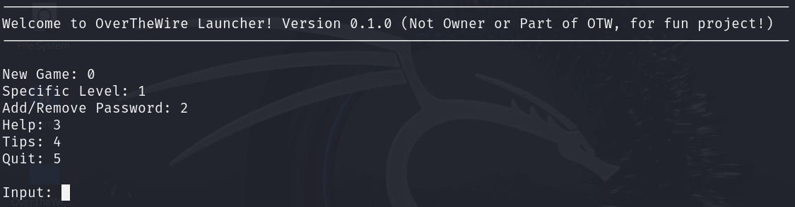

# OverTheWire Launcher 1.0  

This fan-made launcher is designed to make OverTheWire challenges more accessible and beginner-friendly. It helps simplify the process, allowing you to focus on learning Linux while offering features to save passwords and navigate through levels efficiently.  

**Disclaimer:** This launcher is not affiliated with OverTheWire. All levels and content are from their website. For detailed information on each level, visit [OverTheWire Bandit](https://overthewire.org/wargames/bandit/).  

### Key Features  
- Start from **Level 0** and progress step-by-step, or select levels you’ve already completed.  
- Store and manage your passwords securely for easy access to previously beaten levels.  
- Beginner-friendly with tips to guide you through the challenges.  
- Perfect for newcomers looking for a more visual, UI-driven way to learn Linux basics.  

### Requirements  
- Ensure `sshpass` is installed on your system.  
- Make all scripts executable after downloading the launcher.  

---

### **Setup Instructions**  

#### Step 1: Download the Launcher  
1. Download the launcher from the provided link or repository.  
2. Extract the files to your desired directory.  

#### Step 2: Install Required Tools  
1. Open your terminal.  
2. Install `sshpass` by running:  
   ```bash
   sudo apt update && sudo apt install sshpass
   ```  
   (For non-Debian systems, use your package manager, e.g., `brew` on macOS or `yum` on Fedora.)  

#### Step 3: Make Scripts Executable  
1. Navigate to the launcher directory in your terminal.  
   ```bash
   cd /path/to/launcher
   ```  
2. Make all scripts executable by running:  
   ```bash
   chmod +x *.sh
   ```  

#### Step 4: Launch the Program  
1. Run the launcher with the following command:  
   ```bash
   ./launcher.sh
   ```  

#### Step 5: Begin Playing  
- Select **Level 0** to start fresh or choose a previously beaten level (password storage required).  
- Follow the tips and use the features to enhance your learning experience.  

---

### Notes  
- This tool requires an internet connection to interact with OverTheWire servers via SSH.  
- Passwords for completed levels are stored locally for convenience.  
- Feel free to share this launcher with friends, especially those new to Linux.  

**Have fun, and enjoy learning Linux!**  
  
